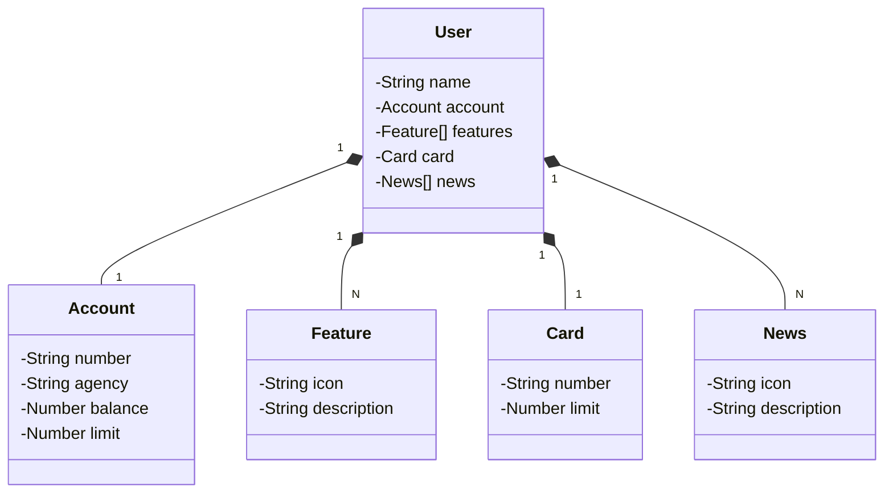

# About Project
This API was developed thinking about creating a banking system similar to one of the largest banks in Brazil... Santander

# Class structure (Domain API)

# Technologies used

**Java** - For the development of the application back-end.  
**Spring** - Framework used in apllication.  
**PostegreSQL** - Database used.  
**Gradle** - For dependency management.
**Hibernate** - For high-performance object/relational querying and persistence.  
**Git** - For version control

# What problem does this API solve?
- This API that I developed was made thinking about helping people create a bank account, more easily and quickly, faster transfers, faster responses, and of course... a lighter and more optimized application, and with a system fluid.
